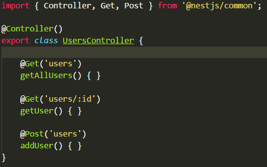
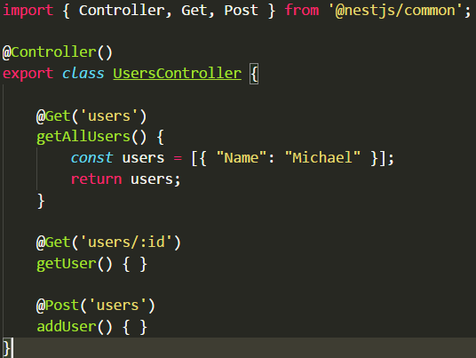
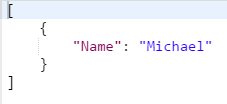
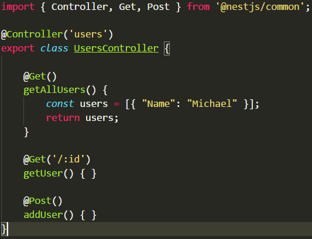
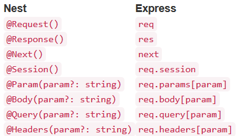
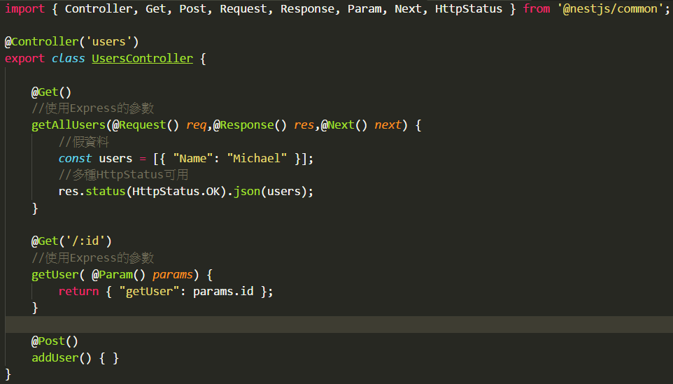
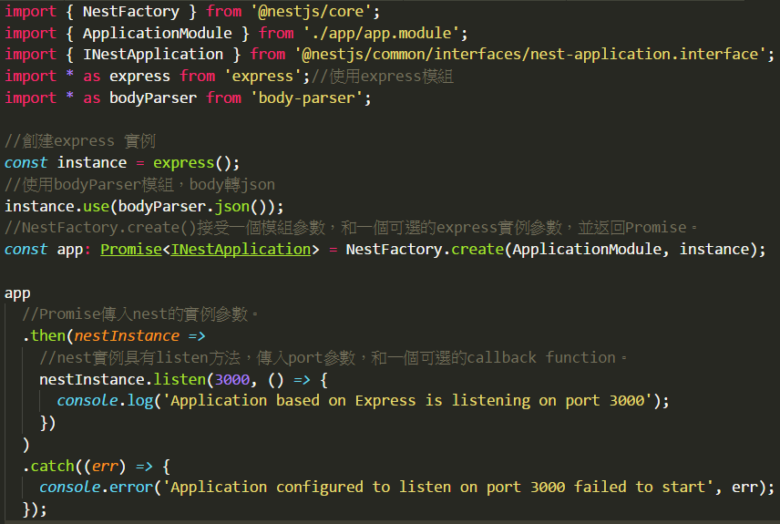

# Nest.js framework 30天初探:Day02 Controllers

## Controllers

說明: 主要是接收從Client發出的HTTP Request，Controllers作為路由層，商業邏輯盡量別在Controllers裡撰寫，讓Controllers專心處理HTTP Request，接下來我們來實際寫程式。
1. 在資料夾根目錄，下cmd指令，創建Users資料夾:
```
cd src/app & mkdir Users
```
2. 在src/app/Users，新增users.controller.ts，其程式碼如下:


說明: UsersController是一個帶有裝飾器(Decorator)的類，我們定義好了上述/users、/users/:id，但ApplicationModule(根模組)，尚未引用UsersController，程式會完全沒變化，所以要去src/app/app.module.ts改寫程式碼。

3. 在src/app/app.module.ts，改寫成下圖所示。


說明: 如此ApplicationModule就知道有UsersController的存在，程式也會去執行它。

4. 下cmd指令，重啟server，並使用postman觀察http://localhost:3000/users
```
ctrl+C
npm start
```

說明: 觀察到Console畫面，UserController有load進去、路徑也有map，且[Postman](https://www.getpostman.com/apps)的結果會得到200狀態碼，代表Controller已經有被運行成功。

5. 向/users發Http GET請求時，回傳點假資料看一下，程式碼修改如下圖。


6. 下cmd指令，重啟server，並使用[Postman](https://www.getpostman.com/apps)觀察http://localhost:3000/users
```
ctrl+C
npm start
```


說明: 結果符合預期。

7. 在每個裝飾器(Decorator)都寫路徑似乎很麻煩，我們可以直接在Controller傳入路徑前綴，程式碼修改如下圖。


說明: 程式碼精簡許多，適合寫Restful API。

8. Nestjs有對比Express自定義參數，下圖為對照表。



9. 使用Nestjs自定義的Express參數，修改程式碼如下圖。


10. POST 部分，我們建立一個檔名為create-users.dto的DTO類別(Data Transfer Object)，並定義好schema，如下圖所示。
```
cd src/app/Users & mkdir DTO
cd DTO
```


11. 修改UsersController程式碼如下圖。


12. 尚須引用bodyParser模組，故在程式根目錄下cmd指令。
```
npm install body-parser @types/body-parser --save
``` 
13. 安裝成功後，修改server.ts，引用bodyParser模組並且作為middleware使用，如下圖所示。


14. 接著，透過[Postman](https://www.getpostman.com/apps) 往/users POST 一組JSON物件，如下圖所示。


15. POST 部分大功告成，可以收到Client POST過來的 Body，如下圖所示。
